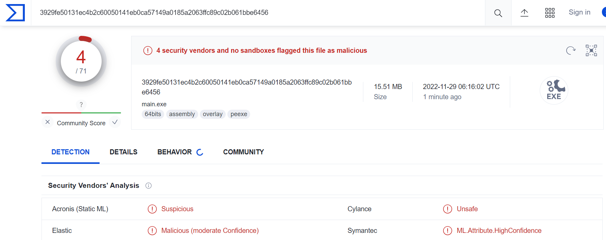
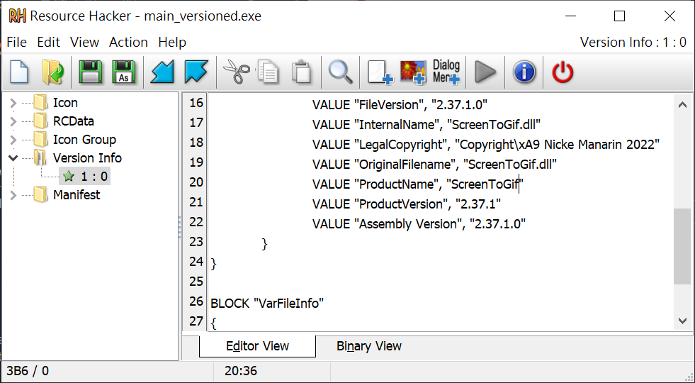
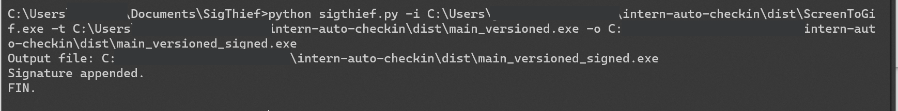
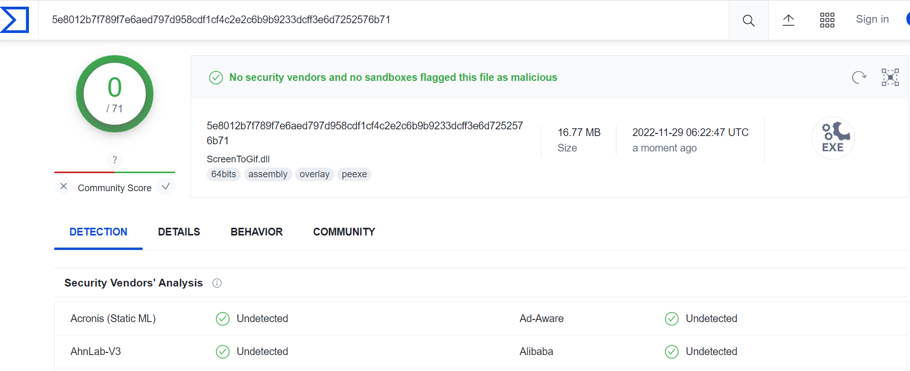

# GSS Intern Checkin System POC


## 說明

GSS實習生Google Sheet簽到的自動化腳本POC

### 衍生應用

- 更嚴謹、有效率的實習生簽到系統(權限控制、自動化、方便性)
- 基於舊模式(以Google Sheet為DB)，將此POC模組化導入`flask` or `fastapi`建立web版簽到服務。可兼容原本Google Sheet管理實習生資料的模式(加入權限控制)
- 自動化工時結算、Email通知

## 使用方法

1. [下載](https://github.com/opabravo/intern-checkin-poc/releases/download/1.0/gssi.exe)包裝好的EXE檔
2. 按照`gspread`的[官方文件](https://docs.gspread.org/en/latest/oauth2.html)取得`credentials.json`，並將其存到`./service_acc.json`
3. 第一次執行會要求輸入`員工ID`與`實習生簽到表的KEY`(在URL裡)，之後可到`./config.json`修改

## 主要功能

```console
usage: main.py [-h] [-v] [-c | -s SHOW_WORKING_HOURS]

GSS實習生通用腳本 https://github.com/opabravo/intern-checkin-poc

options:
  -h, --help            show this help message and exit
  -v, --verbose         顯示詳細資訊，並存到logs.log
  -c, --check-in        一鍵簽到
  -s SHOW_WORKING_HOURS, --show-working-hours SHOW_WORKING_HOURS
                        Fetch總工作時數 <年分:int>，例如：-s 2022

Press any key to exit...
```

1. 一鍵自動簽到
2. 實習時數計算(用於學校實習時數核對)


---

## 開發(限開發人員)

### 環境

- Python 3.10+
- `pip install poetry`

### 包裝

#### Clone後安裝依賴

```bash
git clone https://github.com/opabravo/intern-checkin-poc.git
cd intern-auto-checkin
poetry install
poetry shell
```

#### Pyinstaller + ResourceHacker 打包

```bash
pyinstaller -F main.py -n gssi_origin

ResourceHacker.exe -open ./dist/gssi_origin.exe -save ./dist/gssi.exe -action addoverwrite -res gssi.res
```

沒有加version info會被防毒誤報



可以用Resource Hacker clone其他正規exe的version info



再用sigthief簽署無效的數位簽章



[Virustotal](https://www.virustotal.com/gui/file/bc769935017684dd170380293e94ff9e2a236484f45145750140f8cbc7af9645/details) -> `0/71`

